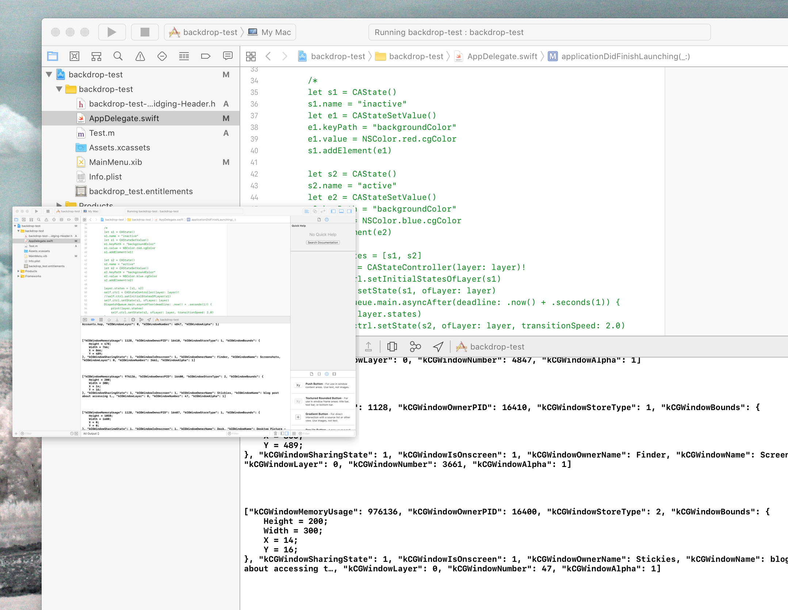

# CAPluginLayer & CABackdropLayer

There's a lot of cool CoreAnimation goodies hiding around in the private headers, but there are three private `CALayer` classes that really caught my eye: `CAProxyLayer`, `CALayerHost`, `CABackdropLayer`, and `CAPluginLayer`. `CALayerHost` is similar in design to `CARemoteLayerClient/Server`, so I'll be writing about both of these classes in a later post. I experimented with `CAProxyLayer` a little bit, as it's used for visual effects (think `NS/UIVisualEffectView`) and either I didn't know the right constants or wasn't using it correctly, but I couldn't get it to work reliably without nuking `windowserver`. I'll talk about the remaining two, using code samples.

<!--truncate-->

# CAPluginLayer

This one is pretty weirdly named, but it looks like it was designed to support `windowserver` plugins - there's even a vtable, but as of right now, only `com.apple.WindowServer.CGSWindow` is supported. Here's a code sample:

```swift
let layer = CAPluginLayer()
layer.frame = CGRect(x: 50, y: 50, width: 200, height: 200)
layer.pluginType = "com.apple.WindowServer.CGSWindow"
layer.pluginId = UInt64(self.window.windowNumber)
layer.pluginGravity = kCAGravityResizeAspect
//layer.pluginFlags = 0x4 // display without a shadow
```



So the big takeaway is, right now you can only use `CAPluginLayer` to mirror a window in real time (all its UI changes and interactions are reflected in the layer contents). You can set a `pluginGravity` similarly to `contentsGravity`, and the only known `pluginFlags` value is `0x4`, used by Dock to display the window without a shadow. 

The `pluginId` actually refers to the `windowNumber` (or `_realWindowNumber` depending on your window type, but that's usually not a concern) and actually can be **any window available on screen!* That's right - you can mirror any window, not just your own app's windows. For fun, I used `CGWindowListCopyWindowInfo` to grab the frontmost window (that wasn't my own app's) and used that id to mirror it into my app's layer. One might conclude at this point that it's a huge security violation if I can see the contents of ANY application's windows, but that's not the case. Using the Xcode UI hierarchy capture tool, you won't be able to see anything inside the layer, and this is because `CAPluginLayer` renders within the `windowserver` (and thus requires `layerUsesCoreImageFilters` to be `false`).  

The Dock uses this to display minimized windows and AppKit uses it to manage the toolbar in full-screen window transitions (in which the toolbar and titlebar are actually moved into a new window anchored to the screen's menubar). In your own app, supposing you're using a long-running XPC daemon for something already, you could request the daemon to help you animate your windows seamlessly if you didn't want to use `CGSWindow*` functions or make a fake window screenshot layer and animate that instead. You would send your window's `windowNumber` over to the daemon which would use a screen-sized `NSWindow` with a `CAPluginLayer` inside (be sure to set `pluginFlags` to `0x0`!) and animate that layer. There's a lot of things wrong with this approach, but it's fun to try it out!


# CABackdropLayer

The `CABackdropLayer` is used to display layer blending on iOS (`UIVisualEffectView`) and within-window-only layer blending on macOS (`NSVisualEffectView`). Here's a code sample:


```swift
let layer = CABackdropLayer()
layer.frame = CGRect(x: 0, y: 0, width: 200, height: 200)
layer.allowsHitTesting = true
layer.groupName = "group_name_here"
layer.windowServerAware = true
let blur = CAFilter(type: kCAFilterGaussianBlur)!
blur.setValue(true, forKey: "inputNormalizeEdges")
blur.setValue(30.0, forKey: "inputRadius")
let saturate = CAFilter(type: kCAFilterColorSaturate)!
saturate.setValue(1.8, forKey: "inputAmount")
layer.filters = [blur, saturate]
layer.name = "backdrop"
layer.scale = 0.25
layer.bleedAmount = 0.2
```


When using `CABackdropLayer`, be sure to set `windowServerAware` to `true`, and set `layerUsesCoreImageFilters` on its parent view to `false`, otherwise the effect won't work (as it's also rendered in `windowserver`). Any combination of `CAFilter`s will work on the `CABackdropLayer`, as none that I've tried have failed me yet, but in the code sample, I've replicated the macOS Sierra saturated vibrant light appearance (as close as possible). The `scale` is important to set as I believe it's the sampling size of the underlying contents, and setting it to `2.0` made rendering quite slow. I'm also not sure why, but `groupName` is always set on a backdrop layer and it's always unique. It has something to do with `windowserver` rendering as there is a property to make it a "globally unique" name. 

I would recommend against using `CABackdropLayer` over `NSVisualEffectView` as there are a lot of edge cases that aren't correctly handled unless using the AppKit class, but for an educational exercise or a venture into the wilderness with some interesting filter combinations (maybe `vibrantDark` just isn't doing it for you?) it could yield some great blending effects.

