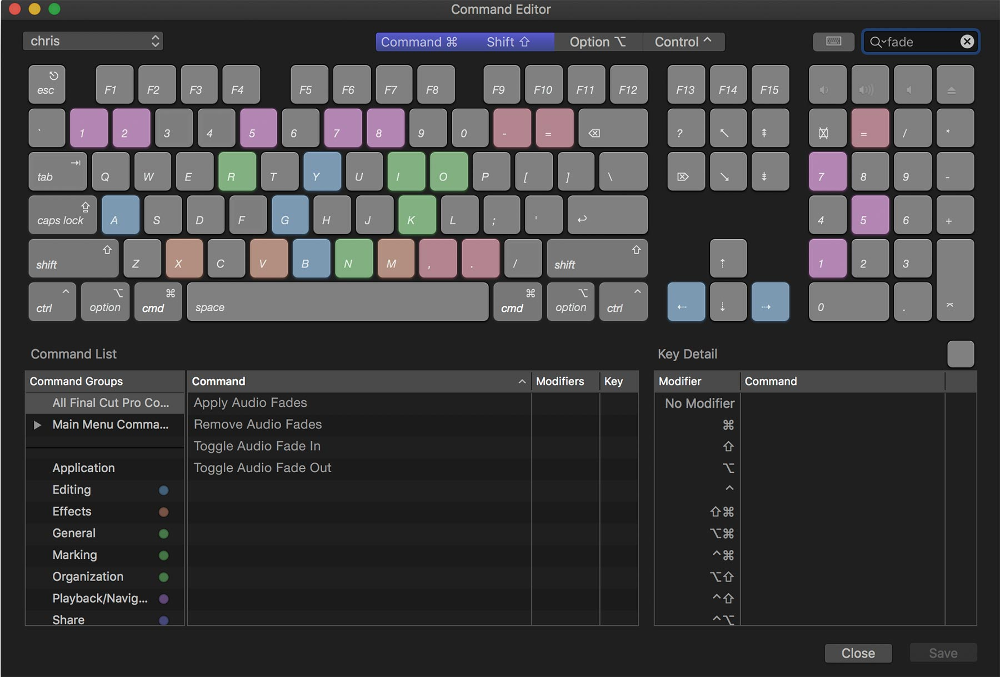
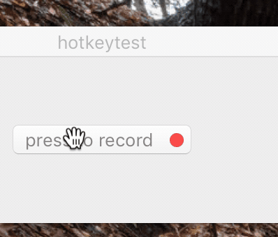
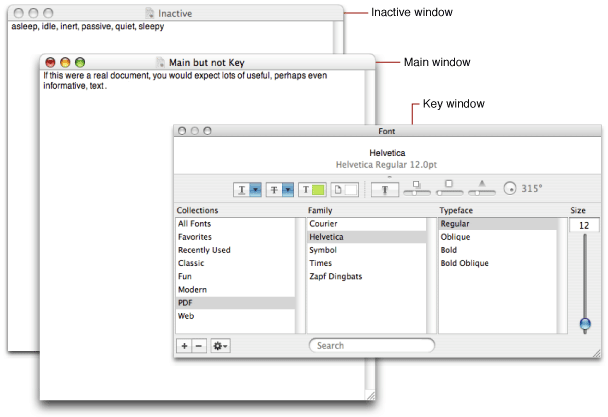

# An Exercise in Modern Cocoa Views

Like I said in the previous "episode", recently, I've wanted to get around to adding "hot key" support for Parrot, and realized I didn't like any of the existing solutions:

1. Use `MASShortcut` or `ShortcutRecorder` which are tried and proven to work in ObjC-land.
2. Use a new but not proven Swift hotkey recorder (there's a few out there).
3. Roll my own (probably somehow using dangerous private SPI) and not test it at all! 

*Obviously I went with option #3.* 

And here we are now, onto part two of the thrilling saga in which you witness me breaking AppKit and WindowServer and inviting the wrath and fury of the engineers that work on said components. I hope you brought your popcorn. 

<!--truncate-->

I'd like to clarify that we'll only be building a single self-contained control that manages a single shortcut. I expect Parrot, like most apps, will not need a Command Editor like Final Cut Pro, which is purpose-built for video editors with more than two keyboards and more than two hands to match, clearly.



Our end result will look, sound, and feel something like this, instead:



Before we get into the nitty gritty hand-holding pair-programming stuff, if you'd like to jump straight to the comment-annotated final source code, [I've included a snapshot here.](https://gist.github.com/avaidyam/32975976c23dd3b38336f22d971f5eaa) It's the whole final product, exactly 1500 LOC, including the code from the previous "episode" - the corresponding keyboard shortcut facility! If you think this should be a formal repository and whatnot, contact me on Twitter or Github @avaidyam!

## Principles of Modern Views

### Subclassing a `View` or a `ViewController`

The first question we should answer is, what kind of component are we building? The answer to this question is what determines what kind of a subclass we are, as well as the interaction model we have with other components in our app. 

When you're building a discrete component that takes a program input and presents a display to the user, and in the case of a control, receives user input and presents a program output, you should be subclassing a `View`. Anything beyond that should be a subclass of a `ViewController`, a component that mediates interactions between other components, or a component that handles model/database objects, or really just anything else. A `View` should be easily reusable in other contexts outside of the one you're building in immediately, but a `ViewController` is not necessarily capable of fulfilling this contract. 

For example, a contact avatar would best be a `View` subclass, but a contact avatar **picker** should be a `ViewController`, as it not only displays an avatar image, but it also allows the user to select an image, and might handle the synchronization with the contact store (maybe it's a JSON file, maybe it's a remote API, or maybe it's a `CNContact`). 

On macOS, you should also consider subclassing an `WindowController` if the component you're building both composes other components (like a `ViewController`) and is self-contained in a `Window` -- a contact avatar picker may not fit this criteria, but a contact **editor panel** would, where the contact avatar picker would be a `ViewController` nested within, alongside name, phone, email, and other editable fields.

### Layers

While `AppKit` is often seen as a dinosaur compared to its younger sibling, `UIKit`, it's important to know that nearly all the design patterns that `UIKit` sports came from `AppKit`, and if not, they eventually make their way back into `AppKit`, with the exception of a very limited few. For example, the concept of a `UIView` being backed by an underlying `CALayer` type is very similar to how `NSControl` is (rather, used to be?) backed by `NSCell`. The differences being that the `CALayer` is actually driving the rendering of display content instead of the `UIView`, and that `NSCell` acts as a "rubber stamp" for specific event handling and drawing. 

When it comes to layer-backed views, `AppKit` actually has several modes by which to achieve this: 
1. **Layer-hosting:** 
    * `self.layer = CALayer(); self.wantsLayer = true`
    * The `NSView` owns the `CALayer` and is responsible for creating and managing it; `NSView` does nothing except create its rendering surface.
2. **Implicit Layer-backed and drawn:** 
    * `superview.wantsLayer = true`
    * The `NSView` has an explicitly layer-backed parent and will grant itself a private `CALayer` to draw into, using the rendering surface of the layer-backed parent's `CALayer`.
3. **Implicit Superview Layer-drawn:** 
    * `superview.wantsLayer = true; superview.canDrawSubviewsIntoLayer = true`
    * **If you expect to use animations or any layer-related properties, you must opt out of this!**
    * The `NSView` has an explicitly layer-backed parent whose `canDrawSubviewsIntoLayer` is true, and thus, will not grant itself a `CALayer`, and instead draw directly into the layer-backed parent's `CALayer`. 
4. **Explicit Layer-backed and drawn:** 
    * `self.wantsLayer = true`
    * The `NSView` has explicitly declared itself as layer-backed and will set its layer's `contents` with the result of its `drawRect:` call (that is, drawing directly into the layer).
    * If this view declares that it `canDrawSubviewsIntoLayer`, its subviews are rendered into this view's `layer`. 
5. **Explicit Layer-backed:** 
    * `self.wantsLayer = true; self.wantsUpdateLayer = true; self.layerContentsRedrawPolicy = .onSetNeedsDisplay`
    * *Note: you must actually override the `wantsUpdateLayer` function in your custom `NSView` subclass to achieve this, as there is no setter for the property. This property is queried at each view update cycle, if the view is marked dirty - don't attempt any complex computations here.*
    * The `NSView` has explicitly declared itself as layer-backed and that it will not `drawRect:` into the layer. Instead, the layer is manually managed, **but not owned by the subview**, during the `updateLayer` method.
    * It's important to set `layerContentsRedrawPolicy` to `.onSetNeedsDisplay` here, since the `layer.contents` are no longer dependent on your `drawRect:`.

*Note: where I say "rendering surface", the underlying type is either a `CAContext`, which is used by the WindowServer to render your layers out-of-process, **or** by `CAViewRef` which can be thought of as a wrapper around `CA::Render::*`, which is rendered in-process but likely off the main thread.*

Personally, I think the `NSView.layer` property should never have been public; instead, if layer-hosting, it's the view's responsibility to keep a strong reference to its layer, and in explicit `updateLayer` views, the `updateLayer` method signature should have been `- (void)updateLayer:(CALayer *)layer`, so as to pass in the `AppKit`-owned layer for the view to update. Too many iOS developers mistake `NSView` for being identical to `UIView`, where it's almost even orthogonal to it depending on the scenario. `UIView`'s layer ownership model is most closely represented by layer-hosting, but in AppKit, this means layer hierarchies and other view facilities are not managed for you, and so, the closest to it would be explicit layer-backed. This is the approach we'll be taking. It may appear that you won't be able to use `drawRect:`, but there are ways to work around that, as we'll see soon.

### `NSControl`?

The next question we need to tackle is, should we design a subclass of `NSControl` or `NSView`? In this specific instance, the answer is pretty straight forward, as we're designing a control, it makes the most sense to take advantage of `NSControl`... it's in the name, after all. 

However, here's a few things you'll want to consider:
* **`NSCell`:** Because this class has been soft-deprecated, it's pretty safe to assume `NSControl`s can be written without a corresponding cell (spoiler alert: yep).
* **Polymorphic `*Value` Properties:** `NSControl` has several `*Value` properties, like `objectValue`, and `take*ValueFrom(_:)` methods to go along with them, for use in Interface Builder and Cocoa Bindings. These aren't really that helpful, from my experience, and if they were, re-implementing them for `NSView` classes isn't that hard.
* **Field Editors:** This is another of those `NeXT`-era ideas, where instead of loading say, a hundred, heavyweight `NSTextView`s into a window, which would kill performance and memory, you would only load one, and share it across a hundred lightweight `NSTextFieldCell`s. It doesn't make much of a difference in 2018, especially since your memory and performance competition are Electron apps: **as long as you don't use Electron (or develop in JS for Desktop apps), you're winning.**
* **Target/Action Model:** This is what we know and love `NSControl` (and `UIControl`) for! A control has a target, and an action that fires on that target, when the control has been activated somehow. `UIControl` goes a step further, allowing you to register different targets for different event types, but `NSControl` offers a single condition-setting `sendAction(on:)` version. It's arguable which is more convenient.

In summary, there's a few reasons to use or not use `NSControl`, but after weighing out the options, a standard of conformity in being a "control," and just having the target/action model already implemented for you is pretty helpful, so we'll go with that.

## Working With `CGSKeyboardShortcut`

### Human-Readable String Representation

Before we begin building a user-facing control, we need to make sure `CGSKeyboardShortcut` and friends can be translated to a human-readable string representation. This is because modifiers and virtual key codes that compose a shortcut like `⌘D` are device-independent mechanism, and when registering a shortcut, we can't use a string containing the shortcut. It's important to note that virtual key codes are not ASCII-ordered (that is, sequential in the ASCII table), and may not always have a corresponding glyph to match the key. To determine what the virtual key code points to on the current keyboard, we unfortunately have to return to `Carbon.framework` for *Text Input Services* (`TIS`) and *Unicode Utilities* (`UC`). To translate the key code, we grab the current input source's keyboard layout, and use the `UCKeyTranslate` facility to determine what the unicode character resulting from pressing this key in the current layout will be. There are a few special cases like Fn keys that print `F13`, for example, or the spacebar, which we want to print `Space`.

*Cocoa key equivalents, used by `NSMenu` and `NSButton`, for example, internally translate a string containg `"x"` into the right virtual key code; this is left as an exercise for the reader. Hint: just create a reverse mapping table and look it up!*

```swift
public extension CGKeyCode {
    public var isFunctionKey: Bool {
        switch Int(self) {
        case kVK_F1, kVK_F2, kVK_F3, kVK_F4, kVK_F5, kVK_F6, kVK_F7, kVK_F8,
             kVK_F9, kVK_F10, kVK_F11, kVK_F12, kVK_F13, kVK_F14, kVK_F15,
             kVK_F16, kVK_F17, kVK_F18, kVK_F19, kVK_F20:
            return true
        default:
            return false
        }
    }

    public var characters: String {
        if let special = CGKeyCode._special[Int(self)] { return special }
        
        let source = TISCopyCurrentASCIICapableKeyboardLayoutInputSource().takeUnretainedValue()
        let layoutData = TISGetInputSourceProperty(source, kTISPropertyUnicodeKeyLayoutData)
        let dataRef = unsafeBitCast(layoutData, to: CFData.self)
        let keyLayout = unsafeBitCast(CFDataGetBytePtr(dataRef), to: UnsafePointer<CoreServices.UCKeyboardLayout>.self)
        
        let keyTranslateOptions = OptionBits(CoreServices.kUCKeyTranslateNoDeadKeysBit)
        var deadKeyState: UInt32 = 0
        let maxChars = 256
        var chars = [UniChar](repeating: 0, count: maxChars)
        var length = 0
        
        let error = CoreServices.UCKeyTranslate(keyLayout, self,
                                                UInt16(CoreServices.kUCKeyActionDisplay),
                                                0, UInt32(LMGetKbdType()),
                                                keyTranslateOptions, &deadKeyState,
                                                maxChars, &length, &chars)
        
        if error != noErr { return "" }
        return NSString(characters: &chars, length: length).uppercased
    }
    private static var _special: [Int: String] = [...]
}

public extension CGEventFlags {
    public var characters: String {
        var string = ""
        if self.contains(.maskAlphaShift) { string.append("⇪") }
        if self.contains(.maskHelp) { string.append("?⃝") }
        if self.contains(.maskControl) { string.append("⌃") }
        if self.contains(.maskAlternate) { string.append("⌥") }
        if self.contains(.maskShift) { string.append("⇧") }
        if self.contains(.maskCommand) { string.append("⌘") }
        return string
    }
}

public extension NSEvent.ModifierFlags {
    public var characters: String {
        return CGEventFlags(self).characters
    }
}
```
*Portions of this code are copyright © 2016 Shunsuke Furubayashi, author of the `Magnet` library.*

### A Simpler Shortcut Representation

Because we don't want to lock ourselves into `CGSKeyboardShortcut`, and we don't exactly manage state like `identifier` or `acquisitionPolicy`, which are more within-app intrinsics, we'll define a new, simpler type: `KeyboardShortcutView.Pair = (CGKeyCode, CGEventFlags)`, and create two wrapper functions to transform it to and from an `NSDictionary`. This is important because we'll need to be able to encode and decode it for state restoration and `NSCoding`.

```swift
open class KeyboardShortcutView: NSControl, ... {
    public typealias Pair = (keyCode: CGKeyCode, modifierFlags: CGEventFlags)
}

public func representation(of pair: KeyboardShortcutView.Pair?) -> NSDictionary? {
    guard let pair = pair else { return nil }
    return [
        "keyCode": pair.keyCode,
        "modifierFlags": pair.modifierFlags.rawValue
    ] as NSDictionary
}
public func representation(of dict: NSDictionary?) -> KeyboardShortcutView.Pair? {
    guard let dict = dict as? [String: Any],
        let kc = dict["keyCode"] as? CGKeyCode,
        let mf = dict["modifierFlags"] as? CGEventFlags.RawValue
        else { return nil }
    return (kc, CGEventFlags(rawValue: mf))
}
```

With that, we have a facility to converse with other keyboard shortcut libraries or non-Swift objects, like `UserDefaults`. *(Recall that tuples cannot conform to `Codable`!)*

## Being A Good Citizen

We'll have our recorder control compose a label (`NSTextField`) and a record/stop button (`NSButton`):

```swift
open class KeyboardShortcutView: NSControl, ... {

    /*@objc*/ open weak var delegate: KeyboardShortcutViewDelegate? {
        willSet { self.willChangeValue(forKey: #function) }
        didSet { self.didChangeValue(forKey: #function) }
    }
    
    @objc open override var alignment: NSTextAlignment {
        get { return self.textLabel.alignment }
        set { self.textLabel.alignment = newValue }
    }
    
    @objc open var tintColor: NSColor = .keyboardFocusIndicatorColor {
        didSet { /* ... */ }
    }
    @objc open var placeholderString: String? {
        get { return self.textLabel.placeholderAttributedString?.string }
        set {
            let style = NSMutableParagraphStyle()
            style.alignment = self.alignment
            let attr = NSAttributedString(string: newValue ?? "", attributes: [
                .foregroundColor: NSColor.secondaryLabelColor,
                .paragraphStyle: style
            ])
            self.textLabel.placeholderAttributedString = attr
        }
    }
    
    @objc open override var isEnabled: Bool {
        didSet { /* .. */ }
    }
    
    open override var isHighlighted: Bool {
        // ...
    }
    
    private lazy var clearButton: NSButton = {
        let button = NSButton()
        button.wantsLayer = true
        button.translatesAutoresizingMaskIntoConstraints = false
        button.image = NSImage(named: .stopProgressTemplate)
        button.bezelStyle = .texturedRounded // for template image rendering
        button.setButtonType(.momentaryChange)
        button.isBordered = false
        button.title = ""
        button.target = self
        button.action = #selector(self.buttonAction(_:))
        return button
    }()
    
    private lazy var textLabel: NSTextField = {
        let label = NSTextField()
        label.wantsLayer = true
        label.translatesAutoresizingMaskIntoConstraints = false
        label.isEditable = false
        label.isSelectable = false
        label.isContinuous = false
        label.isEnabled = true
        label.textColor = self.tintColor
        label.backgroundColor = .clear
        label.refusesFirstResponder = true
        label.drawsBackground = false
        label.isBezeled = false
        label.lineBreakMode = .byClipping
        label.setValue(true, forKey: "ignoreHitTest")
        return label
    }()

    public override init(frame frameRect: NSRect) {
        super.init(frame: frameRect)
        self.commonInit()
    }

    public required init?(coder: NSCoder) {
        super.init(coder: coder)
        self.commonInit()
    }
    
    private func commonInit() {
        self.wantsLayer = true
        self.layerContentsRedrawPolicy = .onSetNeedsDisplay
        self.translatesAutoresizingMaskIntoConstraints = false
        self.addSubview(self.clearButton)
        self.addSubview(self.textLabel)
        self.isEnabled = true // NSControl.isEnabled is false by default.
        self.alignment = .center
    }
}
```

This bit of code is pretty basic subview setup, and we're using lazy initialization for our views, but it's not necessary to do so. In addition, we've added or overridden some properties that forward into our `subviews` or to our `superclass`. Remember to always set `wantsLayer`, `layerContentsRedrawPolicy` **and definitely never forget `translatesAutoresizingMaskIntoConstraints` or you will cry.** Notice that we didn't touch constraints in our `commonInit()`, and I'll explain why soon.

Speaking of that, there's a particular side effect of invoking setters in `commonInit()` versus in the initializer itself: it allows us to call the `didSet` on the property! Just be aware of that, and double check that there are no unintended side effects in your `didSet`s. Note the `will/didChangeValue` in our properties, though - we used `#function` as the key path, but these aren't the magical Swift `KeyPath`s (like `\.isRecording`) we got in Swift 4.1! What gives? It actually is because we aren't able to mark our properties as `@objc` because they aren't able to be represented in ObjC. As a workaround, we're able to get the ObjC `KeyPath` stuff working, but it's by no means a good solution. If you have a better solution, let me know!

Take note that we have to wrap the `placeholderString` in an `NSAttributedString` because the default label color is way too dim/translucent and therefore hard to read. This causes an unintended non-updating effect: `alignment` should be set before setting `placeholderString`, because we're not updating the `placeholderString`'s `paragraphStyle`'s `alignment` in `updateLayer`, and so `placeholderString`, if set only once, uses the exact value given to it at that time.

A few more notes about the subviews:
  * `ignoreHitTest` is a **Private SPI**! We need it though, because without this flag, the label steals our firstMouse/responder status. If you would rather *not* do this, subclass `NSTextField` and override `hitTest:` to return `nil`. It has the same effect.
  * To render template images (that is, `NSImage`s whose `isTemplate` is `true`, or their name ends with `Template`) in the current `NSAppearance`, `NSButton` has to be a textured style. This adds a little bit of padding around the button, so we'll take that into account when working with constraints.

Since we'll also be using the `NSControl` target/action model, our `delegate` should primarily be for decision-making. If we wanted to focus on notification of control state, it's better to use `NSNotificationCenter`, which some Cocoa text classes do.

```swift
public protocol KeyboardShortcutViewDelegate: class {
    func keyboardShortcutViewShouldBeginRecording(_ keyboardShortcutView: KeyboardShortcutView) -> Bool
    func keyboardShortcutView(_ keyboardShortcutView: KeyboardShortcutView,
                              canRecordShortcut shortcut: KeyboardShortcutView.Pair) -> Bool
    func keyboardShortcutViewDidEndRecording(_ keyboardShortcutView: KeyboardShortcutView)
}
```

There - now we have a pretty effective API client interface to determine what the control should do in a given situation, along with a visual foundation.

### Accepting Key View

The important part of a control is to allow the user to activate and deactivate it, which we'll do by just clicking within or outside of the control bounds. It's very easy to allow becoming the key view or first responder:

```swift
open override var acceptsFirstResponder: Bool {
    return self.isEnabled
}

open override var canBecomeKeyView: Bool {
    return super.canBecomeKeyView && NSApp.isFullKeyboardAccessEnabled
}

open override var needsPanelToBecomeKey: Bool {
    return true
}

open override func acceptsFirstMouse(for event: NSEvent?) -> Bool {
    return true
}

open override func performClick(_ sender: Any?) {
    self.window?.makeFirstResponder(self)
}
```

That's all you need to do! Now, clicking inside the control will give us key input, which we'll focus on in the next section. 

### Responding to User Input

This is the meat of the control: actually recording the shortcut. The first thing we should do is get our `isEnabled`, `isHighlighted`, `isRecording` properties correctly wired together. We shouldn't be able to set our highlight state because that's for the user to do; instead, wire its getter through to `isRecording`. The two main properties are `shortcut` and `inputModifiers`, the latter of which we'll use to track which modifier flags are set when the user is entering the shortcut. When setting the `shortcut`, we'll use the `NSControl` target/action mechanism to send our `action` to our `target`. If we don't have a defined `target` (that is, it's `nil`), the message travels up the responder chain automatically! If the client (instead of the user) sets the `shortcut` directly, it'll still trigger the action, so keep that in mind - the solution to this is to wrap it in an `if self.isRecording`, but in this case, it's the behavior we might want.

```swift
@objc open override var isEnabled: Bool {
    didSet {
        if !self.isEnabled { self.endRecording() }
    }
}

open override var isHighlighted: Bool {
    get { return self.isRecording }
    set { }
}

@objc open private(set) var isRecording = false {
    willSet { self.willChangeValue(forKey: #function) }
    didSet { self.didChangeValue(forKey: #function) }
}
/*@objc*/ open var shortcut: KeyboardShortcutView.Pair? {
    willSet {
        guard self.shortcut?.keyCode != newValue?.keyCode &&
            self.shortcut?.modifierFlags != newValue?.modifierFlags else { return }
        self.willChangeValue(forKey: #function)
    }
    didSet {
        guard self.shortcut?.keyCode != oldValue?.keyCode &&
            self.shortcut?.modifierFlags != oldValue?.modifierFlags else { return }
        
        _ = self.sendAction(self.action, to: self.target)
        
        // ...
        self.didChangeValue(forKey: #function)
    }
}

private var inputModifiers: NSEvent.ModifierFlags = [] {
    didSet {
        // ...
    }
}
```

Now we'll have to actually handle mouse activation and keyboard events:

```swift
open override func mouseDown(with event: NSEvent) {
    guard self.isEnabled else {
        super.mouseDown(with: event); return
    }

    let locationInView = self.convert(event.locationInWindow, from: nil)
    if self.mouse(locationInView, in: self.bounds) && !self.isRecording {
        self.inputModifiers = []
        _ = self.beginRecording()
    } else {
        super.mouseDown(with: event)
    }
}
```

If we're enabled, and the mouse press was within our bounds, reset our recording state and begin recording. Next, if our `flagsChanged(with:)` is called, change our input modifiers state (and we'll cover soon how that reflects in the UI). The easy thing about writing a shortcut recorder is that we can use `performKeyEquivalent(with:)`! It's called when a "key equivalent" *(read: "keyboard shortcut")* is pressed and we're first responder. This basically has already taken care of all the work for us, and we just need to validate the new shortcut with the delegate and end recording.

```swift
open override func performKeyEquivalent(with event: NSEvent) -> Bool {
    if !self.isEnabled || !self.isRecording { return false }
    if self.window?.firstResponder != self { return false }
    let shortcut = (keyCode: CGKeyCode(event.keyCode),
                    modifierFlags: CGEventFlags(event.modifierFlags))
    
    // inline validation func if we have no delegate response:
    func validate() -> Bool {
        guard !shortcut.keyCode.isFunctionKey else { return true }
        return !shortcut.modifierFlags.intersection(.maskUserFlags).isEmpty
    }
    
    let del = (self.delegate ?? self.target as? KeyboardShortcutViewDelegate)
    if del?.keyboardShortcutView(self, canRecordShortcut: shortcut) ?? validate() {
        self.shortcut = shortcut
        self.endRecording()
        return true
    }
    return false
}

open override func flagsChanged(with event: NSEvent) {
    self.inputModifiers = self.isRecording ? event.modifierFlags : []
    super.flagsChanged(with: event)
}
```

If we don't have a `delegate`, we'll check if our `target` is *also* capable of being our `delegate` -- this is mostly convenience, kinda like how you have a `delegate` and a `dataSource` for a collection or table view, but usually it's one view controller implementing both. If neither the `delegate` or `target` can help us validate the input, we'll just allow it to go through as long as it's not a single non-Fn key (that is, you shouldn't allow just `Q` as a hot key: that would lead to a lot of problems!).

```swift
open override func keyDown(with event: NSEvent) {
    guard !self.performKeyEquivalent(with: event) else { return }
    super.keyDown(with: event)
}

open override func resignFirstResponder() -> Bool {
    self.endRecording()
    return true
}
```

And with that, we've completed handling our event handling: if we get a stray `keyDown(with:)` message, just invoke `performKeyEquivalent(with:)`, as this can occur in the case described before, where a single non-Fn key is pressed. Again, **allowing this is bad practice and interferes with system keyboard input!** But who are we to judge, right? 

The recording actions take place primarily in `beginRecording()` and `endRecording()`; we could have just placed the body of these methods in `isRecording.didSet` but that would be very very bloated and inappropriate code style. Be sure to handle state correctly and guard against out-of-place calls to these methods, as that can lead to unexpected user-visible state leakage. 

```swift
public func beginRecording() -> Bool {
    if !self.isEnabled { return false }
    if self.isRecording { return true }
    
    let del = (self.delegate ?? self.target as? KeyboardShortcutViewDelegate)
    guard del?.keyboardShortcutViewShouldBeginRecording(self) ?? true else {
        NSSound.beep(); return false
    }
    self.isRecording = true
    return true
}

public func endRecording() {
    if !self.isRecording { return }
    self.inputModifiers = []
    self.isRecording = false
    
    if self.window?.firstResponder == self && !self.canBecomeKeyView {
        self.window?.makeFirstResponder(nil)
    }
    let del = (self.delegate ?? self.target as? KeyboardShortcutViewDelegate)
    del?.keyboardShortcutViewDidEndRecording(self)
}
```

It's pretty self-explanatory, as all we do is consult (or notify) the `delegate`/`target`, and fallback to the assumption that we are allowed to record, if none are available. When we `resignFirstResponder()` or `endRecording()`, we end up calling the opposite method, but these calls aren't re-entrant as `NSWindow.makeFirstResponder(_:)` does the verification for us. Finally, we just need to wire up the `clearButton` action to perform the context-specific thing: if we're not recording but we don't have a set `shortcut`, `beginRecording()`; if we **do** have a set `shortcut`, clear it and end recording. Otherwise, we're already recording - `endRecording()` without losing the previously set `shortcut`, if any.

```swift
@objc private func buttonAction(_ button: NSButton) {
    if !self.isRecording && self.shortcut == nil { // cleared state
        self.window?.makeFirstResponder(self)
        _ = self.beginRecording()
    } else if self.isRecording && self.shortcut != nil { // cleared state
        self.endRecording()
    } else {
        if self.shortcut != nil { self.shortcut = nil }
        self.endRecording()
    }
}
```

### `updateLayer`

Let's take a brief moment to provide a convenience function for visually representing the whole shortcut to the user: 

```swift
private var stringRepresentation: String {
    var modifiers: NSEvent.ModifierFlags = self.inputModifiers
    if self.isRecording {
        return modifiers.characters
    } else {
        if let shortcut = self.shortcut {
            modifiers.formUnion(NSEvent.ModifierFlags(shortcut.modifierFlags))
        }
        return modifiers.characters + (self.shortcut?.keyCode.characters ?? "")
    }
}
```

It's not too much: if we're recording, return the input modifers as a string, but if we're not, use the `shortcut`'s `modifier.characters` **and** the input modifier's, together, along with the `keyCode` as a string at the very end. This will match the canonical string representation seen in `NSMenuItem`s. Since we're explicitly layer-backed and requesting `updateLayer`, we should definitely control our visual appearance here:

```swift
open override var allowsVibrancy: Bool {
    return false
}

open override var wantsUpdateLayer: Bool {
    return true
}

open override func updateLayer() {
    // ...

    self.textLabel.textColor = self.isEnabled ? self.tintColor : .disabledControlTextColor
    
    let str = self.stringRepresentation
    self.textLabel.stringValue = str
    self.toolTip = Localized.tooltipPrefix + ": " + (str.isEmpty ? Localized.noShortcut : str)
                    + "\n\n" + Localized.help
    
    self.clearButton.isEnabled = self.isEnabled
    let canStop = self.isRecording || self.shortcut != nil
    self.clearButton.image = NSImage(named: canStop ? .stopProgressFreestandingTemplate
                                                    : .statusUnavailable)
}
```

You'll notice we set the `tooltip` here as well. It's important to do so per-view, or if we're drawing specific regions with different tooltips, we can use `addToolTipRect...` and friends; these are hover-based context clues as to what the view under the mouse provides, and there's no iOS equivalent. For now, ignore the `Localized...` values, as we'll talk about that later.

Add a `self.needsDisplay = true` call to the `didSet` of the properties: `tintColor`, `shortcut`, `isEnabled`, and `inputModifers`. This will mark the view as needing `updateLayer()` called, which we can then update visual appearances in.

### Drawing a Button Without Being One

An important thing to do in designing and implementing a new control is to **always look and feel like a system control!** It's very obvious to a user when an app doesn't do this and it provides the perception of a cheap or poorly designed app, leading to possible user dissatisfaction. For this control, let's act like a mix between a button and text input, because we act like a mix between the two. A good example of a control that already has this appearance is an `NSSearchField` in an `NSToolbar` (in a regular `NSView`, it looks recessed, but in the toolbar it has a button-like appearance). Instead, however, we'll steal the appearance of an `NSButton` directly using an `NSButtonCell`. Like I said much earlier in the article, `NSCell`s encapsulate both event-handling *and* visual appearance, without being an actual view! We can quite simply share a button cell between all instances of our control and draw it into a sublayer in `updateLayer()`, using the `drawBezel(withFrame:in:)` method. Be sure to add the sublayer to our hierarchy and set the correct `bezelStyle`.

```swift
private static var stampCell: NSButtonCell = {
    let c = NSButtonCell()
    c.bezelStyle = .texturedRounded
    return c
}()

private lazy var underlayer = CALayer()

private func commonInit() {
    // ...
    self.layer?.addSublayer(self.underlayer)
    // ...
}

open override func updateLayer() {
    var b = self.bounds.size; b.height = 22
    let img = NSImage(size: b, flipped: false) { r in
        KeyboardShortcutView.stampCell.drawBezel(withFrame: r, in: self)
        return true
    }
    
    CATransaction.begin()
    CATransaction.setDisableActions(true)
    self.underlayer.contents = img
    self.underlayer.contentsScale = self.layer!.contentsScale // inherit
    self.underlayer.contentsCenter = CGRect(x: 0.25, y: 0.25, width: 0.5, height: 0.5)
    CATransaction.commit()

    // ...
}

open override func layout() {
    super.layout()

    CATransaction.begin()
    CATransaction.setDisableActions(true)
    self.underlayer.frame = self.layer!.bounds
    CATransaction.commit()

    // ...
}
```

*`-[NSButtonCell updateLayerWithFrame:inView:]` actually uses a private `NSLayerContentsFacet` and CoreUI to optimize drawing `CALayer` contents, but it's a non-issue for us.*

If we could use `drawRect:` it might be more straight forward, but we lose the ability to set the `CALayer.contentsCenter` which automatically does 9-part image slicing for us, if the `underlayer` frame and the `content` size don't match up. You might notice that if you just set `layer.frame`, it'll animate and look weird as it snaps into a new frame, where we don't expect this to occur. To fix this, we just open an explicit sub-transaction, which disables `CALayer` actions. Another possible approach to avoid `frame` implicit animations is to modify the layer's `actions` dictionary:

```swift
var implicits = layer.actions
implicits["position"] = NSNull()
implicits["bounds"] = NSNull()
layer.actions = implicits
```

Another small visual issue is that the `NSCell` we're drawing has no understanding of the control's `effectiveAppearance`, unless we tell it using `NSAppearance.current`:

```swift
open override func updateLayer() {
    // ...
    let img = NSImage(size: b, flipped: false) { r in
        self.effectiveAppearance.using {
            KeyboardShortcutView.stampCell.drawBezel(withFrame: r, in: self)
        }
        return true
    }
    // ...
}

// ...

public extension NSAppearance {
    public func using(_ handler: () -> ()) {
        let x = NSAppearance.current
        NSAppearance.current = self
        handler()
        NSAppearance.current = x
    }
}
```

Now, if you set the whole `window`'s `appearance` to, say, `vibrantDark`, the control will render perfectly no matter what size, in that appearance! (It's a little baffling to me that `NSButton`s don't stretch their drawing, but oh well.)

### Focus Rings

Now, as a control that can become key and first responder in its `window`, we should inform the user that we have done so using a focus ring. After macOS Lion, we no longer need to draw them ourselves, but instead provide their bounds and a mask to match our view's shape. Let's just ask our layer to render itself *as* a mask, since only the alpha channel is used for masking!

```swift
open override var focusRingMaskBounds: NSRect {
    return (self.isEnabled && self.window?.firstResponder == self) ? self.bounds : .zero
}

open override func drawFocusRingMask() {
    guard self.isEnabled && window?.firstResponder == self else { return }
    self.underlayer.render(in: NSGraphicsContext.current!.cgContext)
}
```

Now we just need to add a `self.noteFocusRingMaskChanged()` call to `isEnabled.didSet`, so we can show and hide the focus ring automatically. `CALayer.render(in:)` isn't a great idea in most cases because it actually uses the `CG` rendering path, instead of the `OGL` or `Metal` rendering paths that Core Animation can use to accelerate layers on the GPU, and so it's actually a visual approximation to what the layer actually looks like. This doesn't really bother us because we only need the shape to be correct, though, but it's something to keep in mind in general when designing a view with sublayers.

### `layout`, `updateConstraints`, & `intrinsicContentSize` 

Because we have sublayers and subviews, we should adjust their layout here. We've already taken care of `underlayer`, so now let's dynamically resize our `font` to match our control's height. It's surprisingly not straightforward, because the facility to do so is found on `NSFontManager` and not `NSFont`, but using the facility is pretty easy.

```swift
open override func layout() {
    // ...
    
    if let font = self.font {
        self.textLabel.font = NSFontManager.shared.convert(font, toSize: self.bounds.height / 1.7)
    } else {
        self.textLabel.font = NSFont.systemFont(ofSize: self.bounds.height / 1.7)
    }
}
```

Here's where we finally set up and handle constraints! We'll use constraints to handle our subviews, because our sublayer just needs to match our frame. We could, however, add an `NSLayoutGuide` to our control, set up constraints on that guide, and then synchronize its frame to the sublayer frame, but it's not worth the trouble.

```swift
open override class var requiresConstraintBasedLayout: Bool {
    return true
}

private var childConstraints: [NSLayoutConstraint] = []

open override func updateConstraints() {
    if self.childConstraints.count == 0 {
        self.childConstraints = [
            self.textLabel.leadingAnchor.constraint(equalTo: self.leadingAnchor, constant: 4.0),
            self.textLabel.trailingAnchor.constraint(equalTo: self.clearButton.leadingAnchor, constant: 0.0),
            self.clearButton.trailingAnchor.constraint(equalTo: self.trailingAnchor, constant: 0.0),
            self.clearButton.heightAnchor.constraint(equalTo: self.heightAnchor, multiplier: 1.0),
            self.clearButton.widthAnchor.constraint(equalTo: self.clearButton.heightAnchor, multiplier: 1.0),
            self.textLabel.centerYAnchor.constraint(equalTo: self.centerYAnchor, constant: -1.0),
            self.clearButton.centerYAnchor.constraint(equalTo: self.centerYAnchor),
        ]
        NSLayoutConstraint.activate(self.childConstraints)
    }
    super.updateConstraints()
}
```

The gist of it is, `updateConstraints()` is called post-initialization, and whenever we set `self.needsUpdateConstraints = true`, and if we haven't configured any constraints, we'll cache our constraints and activate them. It's helpful to do so in this method because we may, in the future, want to dynamically adjust our constraints, and we can do that in order with the layout and display cycle here.

The last thing we should do as a good citizen control, is provide an `intrinsicContentSize`: this is the size that our control will take up if we don't add any size constraints to it. Usually, it's just the smallest bounding box of the control's contents, which we can sum the `intrinsicContentSize`s of our `textLabel` and `clearButton` to find. Since there's a chance that they might provide a `.noIntrinsicMetric`, and our control *does* have intrinsic metrics for width (both `textLabel` and `clearButton` do, in fact), we should be cautious of that case. We'll factor in our padding from the constraints above as well.

```swift
open override var intrinsicContentSize: NSSize {
    var _t = self.textLabel.intrinsicContentSize
    var _b = self.clearButton.intrinsicContentSize
    if _t.width == NSView.noIntrinsicMetric { _t.width = 0.0 }
    if _b.width == NSView.noIntrinsicMetric { _b.width = 0.0 }
    
    // Compute the sum/max of the intrinsicContentSizes of our subviews.
    return NSSize(width: _t.width + _b.width + 12.0 /* padding */,
                  height: max(_t.height, _b.height) /* 22.0? */)
}
```

We could also take the approach that `NSButton` and similar controls take, which is to clamp the intrinsic size to `22px` in height. For a platform with a cursor, `22px` is the "right height" for a clickable control that contains a label, and for a platform that relies on touch input, it's between `32px` and `44px`. *(That's from the Apple HIG somewhere.)*

### Hover & Cursors 

To support any kind of cursor change or mouse hovering, we need to use `NSTrackingArea` and the related methods on `NSView` used to add and remove them. It's not recommended to use any of the methods with the phrase `TrackingRect` or `CursorRect` in them - they've been superseded since Leopard by `NSTrackingArea`.

```swift
private func commonInit() {
    // ...
    self.addTrackingArea(NSTrackingArea(rect: .zero,
                                        options: [.activeInKeyWindow, .inVisibleRect, .cursorUpdate],
                                        owner: self, userInfo: nil))
}

open override func cursorUpdate(with event: NSEvent) {
    NSCursor.pointingHand.set()
}
```

We don't even have to implement `updateTrackingAreas()` to handle changing frames or anything. The `NSTrackingArea` makes sure that `cursorUpdate(with:)` is only called with the visible frame of the view, when the window containing the view is key. It's dead simple; if we wanted to support mouse hovering, to perhaps display suggestions or change our drawing in some way, we would just change `.cursorUpdate` to `.mouseEnteredAndExited` or `.mouseMoved`. Maybe we just want to change our drawing or cursor when we're the first responder? Just change `.activeInKeyWindow` to `.activeWhenFirstResponder` -- be mindful that the `options` are three individual option sets masked together. You can't use `.activeInKeyWindow` and `.activeWhenFirstResponder` simultaneously for example.

### Haptic & Audio Feedback 

Some controls may want to add audio feedback support, like `NSButton.sound`, but in my opinion, this makes assumptions on the availability and implementation of the audo feedback (what if the client wishes to use `AVAudioPlayer`?); instead, it's probably a better idea to play the sound in our delegate or target/action methods. If we did want to support audio feedback with `NSSound`, however, it's quite simple:

```swift
@objc open var sound: NSSound? = nil

// ...

open func doSomething() {
    // ...
    self.sound?.play()
}
```

Likewise, some controls may want to add haptic feedback, but those controls *(should)* primarily rely on *(specifically)* force touch interaction, like dragging or deep pressing, and our shortcut recording control relies primarily on keyboard input. If we were to, adding simple haptic responses is just as simple, albeit a little more wordy:

```swift
@objc open var hapticPerformer: NSHapticFeedbackPerformer? = NSHapticFeedbackManager.defaultPerformer

// ...

open func doSomething() {
    // ...
    self.hapticPerformer?.perform(.levelChange, performanceTime: .drawCompleted)
}
```

In this specific case, while currently on macOS, there is only a `defaultPerformer`, we can expect that there may be more in the future, perhaps one for the touch bar, as an example. In anticipating such changes, it might be a good idea to allow our client to set the desired `hapticPerformer` - if it's set to `nil`, it acts as if we've disabled haptic feedback.

### Window Keyedness



An important concept on macOS is that of window "keyedness" and "main-ness", as you can see above. Controls are expected to draw accordingly to visually explain to the user if they're able to be interacted with or not. We can monitor our parent `window`'s state without any strong reference to the `window` by using the `viewWillMove(toWindow:)` method, and then trampoline that using `NSNotificationCenter`.

```swift
@objc private func windowKeyednessChanged(_ note: Notification) {
    guard let window = self.window, (note.object as? NSWindow) == window else { return }
    // do nothing for now
}

open override func viewWillMove(toWindow newWindow: NSWindow?) {
    let n = NotificationCenter.default // shorthand
    if let oldWindow = self.window {
        n.removeObserver(self, name: NSWindow.didBecomeKeyNotification,
                         object: oldWindow)
        n.removeObserver(self, name: NSWindow.didResignKeyNotification,
                         object: oldWindow)
    }
    if let newWindow = newWindow {
        n.addObserver(self, selector: #selector(self.windowKeyednessChanged(_:)),
                      name: NSWindow.didBecomeKeyNotification, object: newWindow)
        n.addObserver(self, selector: #selector(self.windowKeyednessChanged(_:)),
                      name: NSWindow.didResignKeyNotification, object: newWindow)
    }
}

deinit {
    NotificationCenter.default.removeObserver(self) // just in case
}
```

Now, we'll get the `windowKeyednessChanged(_:)` notifications whenever keyedness changes (and note that we could do the same for main-ness as well) without worrying about which window we're contained within. The next thing to do is wire our first responder state into the method, which sounds inappropriate, but since we use the method *just* for handling drawing and event state, it's okay to do so without getting pedantic about it.

```swift
open override func becomeFirstResponder() -> Bool {
    DispatchQueue.main.async {
        self.windowKeyednessChanged(Notification(name: NSWindow.didBecomeKeyNotification,
                                                 object: self.window, userInfo: nil))
    }
    return true
}

open override func resignFirstResponder() -> Bool {
    DispatchQueue.main.async {
        self.windowKeyednessChanged(Notification(name: NSWindow.didResignKeyNotification,
                                                 object: self.window, userInfo: nil))
    }
    // ...
    return true
}
```

We need to enqueue the `windowKeyednessChanged` invocation to the main queue because we haven't yet become the first responder until the `become/resignFirstResponder` method returns.

###  Global HotKey Interference

At this point we have a fully functional keyboard shortcut recorder! However... attempting to record certain shortcuts, you'll find, don't work, mysteriously. After a few different shortcuts you've tried to record, it hits you: these are symbolic shortcuts that we've set in the System Preferences! We're accidentally triggering them instead of recording the shortcut! Surely, you wonder, how does System Preferences allow you to record shortcuts without triggering symbolic ones willy-nilly? The answer lies in a den of dragons:

```swift
// Here lie dragons!
fileprivate typealias CGSConnectionID = UInt
fileprivate enum CGSGlobalHotKeyOperatingMode: UInt {
    case enable = 0, disable = 1, universalAccessOnly = 2
}
@_silgen_name("CGSMainConnectionID")
fileprivate func CGSMainConnectionID() -> CGSConnectionID
@_silgen_name("CGSGetGlobalHotKeyOperatingMode")
fileprivate func CGSGetGlobalHotKeyOperatingMode(_ connection: CGSConnectionID,
                                                 _ mode: UnsafeMutablePointer<CGSGlobalHotKeyOperatingMode?>) -> CGError
@_silgen_name("CGSSetGlobalHotKeyOperatingMode")
fileprivate func CGSSetGlobalHotKeyOperatingMode(_ connection: CGSConnectionID,
                                                 _ mode: CGSGlobalHotKeyOperatingMode) -> CGError
```

The answer to recording hotkeys that have been reserved already... is to turn off hotkeys globally while you're first responder. I swear up and down this is exactly what System Preferences does - take a look yourself if you don't believe me! It's pretty simple to cache the existing global state, turn the hotkeys off, and then once we're resigning first responder, reset the global state. Here's what that looks like:

```swift
private var savedOperatingMode: CGSGlobalHotKeyOperatingMode? = nil
    
deinit {
    if self.savedOperatingMode != nil {
        _ = CGSSetGlobalHotKeyOperatingMode(CGSMainConnectionID(), self.savedOperatingMode!)
    }
    // ...
}

@objc private func windowKeyednessChanged(_ note: Notification) {
    // ...
    if window.isKeyWindow && window.firstResponder == self { // becomeKey
        guard self.savedOperatingMode == nil else { return }
        
        _ = CGSGetGlobalHotKeyOperatingMode(CGSMainConnectionID(), &self.savedOperatingMode)
        _ = CGSSetGlobalHotKeyOperatingMode(CGSMainConnectionID(), .disable)
    } else { // resignKey
        guard self.savedOperatingMode != nil else { return }

        _ = CGSSetGlobalHotKeyOperatingMode(CGSMainConnectionID(), self.savedOperatingMode!)
        self.savedOperatingMode = nil
        window.makeFirstResponder(nil) // resign ourselves if window resigned
    }
}
```

A disclaimer: *you don't need to include this to roll a fully functional shortcut recorder.* You **can** ignore the fact that the user will be trying to record shortcuts and then be disappointed that it's not working. You **can!** let your user down! And you **will** if you're submitting your app to the MAS, so keep this in mind. We're not to use this facility for evil, but to respond to exactly what the user is doing. The unfortunate downside is that the symbolic/other hot keys will be triggered when the user double-dips with our app, unless we claim the shortcut exclusively (see, there *was* a reason for that!).

### String Localization

Alright, we're done now right? No one using this control lives outside America (and even those that live within, they definitely speak English fluently, right?) and none of *our users* are disabled right? **Wrong.** Always consider that you, as the developer, are not the target audience of your tool (be it a control, or an app), and always focus on **i18n** and **accessibility**, because like it or not, it's not beneficence, it's a responsibility.

Luckily, localization support is pretty easy, except for the hard part (which is the localization itself). I've opted to wrap it into a `Localized` container with a helper function `value(_:default:comment:)` that looks up the string from the bundle that contains the class. This is important, because your control may or may not be in the `main` bundle. To use it, just create static properties like `Localized.voiceOverBegin` below:

```swift
private enum Localized {
    private static func value(_ key: String, `default`: String, comment: String) -> String {
        return NSLocalizedString(key, tableName: nil, bundle: Bundle(for: KeyboardShortcutView.self),
                                 value: `default`, comment: comment) // helper!
    }

    // ...
    
    fileprivate static var actionName: String {
        return value("action_name", default: "Record Shortcut",
                     comment: "The action name for undo and redo")
    }
    
    fileprivate static var voiceOverBegin: String {
        return value("voiceover_begin", default: "Now recording a shortcut",
                     comment: "The notification name for VoiceOver if the control began recording")
    }

    // ...
}
```

Always provide helpful comments for your translators, and provide a `default` in your expected target language in case you haven't loaded a good `strings` file, or you just plain don't have one in the current bundle.

### Accessibility

I'm no accessibility expert, but here's the bare minimum you should implement for a control that resembles a button and contains other sub-controls. Be sure to conform `KeyboardShortcutView` to `NSAccessibilityButton` and `NSAccessibilityGroup`.

```swift
open override func isAccessibilityElement() -> Bool {
    return true
}
open override func accessibilityHelp() -> String? {
    return Localized.help
}
open override func accessibilityRole() -> NSAccessibilityRole? {
    return .button
}
open override func accessibilityLabel() -> String? {
    let str = self.stringRepresentation
    return str.isEmpty ? Localized.noShortcut : str
}
open override func accessibilityValue() -> Any? {
    return self.accessibilityLabel()
}
open override func accessibilityRoleDescription() -> String? {
    return Localized.tooltipPrefix
}
open override var accessibilityFocusedUIElement: Any? {
    return self.window?.firstResponder == self
}
open override func accessibilityChildren() -> [Any]? {
    return [self.clearButton]
}
open override func accessibilityPerformPress() -> Bool {
    guard self.isEnabled else { return false }
    self.performClick(nil)
    return true
}
```

And while that presents our accessible properties to the accessibility daemons and tools, we should also post notifications using `NSAccessibilityPostNotification` when `shortcut` changes, and definitely emit a VoiceOver announcement when we change recording state or set the shortcut from user input.

```swift

/*@objc*/ open var shortcut: KeyboardShortcutView.Pair? {
    didSet {
        // ...
        NSAccessibilityPostNotification(self, .valueChanged)
        // ...
    }
}
open override func performKeyEquivalent(with event: NSEvent) -> Bool {
    // ...
    if /* we should record the new shortcut */ {
        // ...
        NSAccessibilityPostNotificationWithUserInfo(self, .announcementRequested, [
            .announcement: Localized.voiceOverRecorded,
            .priority: NSAccessibilityPriorityLevel.high
        ])
        return true
    }
    // ...
}


public func beginRecording() -> Bool {
    // ...
    NSAccessibilityPostNotificationWithUserInfo(self, .announcementRequested, [
        .announcement: Localized.voiceOverBegin,
        .priority: NSAccessibilityPriorityLevel.high
    ])
    return true
}

@objc private func buttonAction(_ button: NSButton) {
    // ...
    if /* we should clear the shortcut set */ {
        // ...
        NSAccessibilityPostNotificationWithUserInfo(self, .announcementRequested, [
            .announcement: Localized.voiceOverCleared,
            .priority: NSAccessibilityPriorityLevel.high
        ])
    }
}

open override func updateLayer() {
    // ...
    self.clearButton.setAccessibilityLabel(canStop ? Localized.buttonRecordLabel
                                                   : Localized.buttonClearLabel)
}
```

```swift
in KeyboardShortcutView.clearButton.getter:
        button.toolTip = Localized.buttonTooltip
        button.setAccessibilityHelp(Localized.buttonTooltip)
```

We don't just place the VoiceOver announcements in `willSet`/`didSet` for `isRecording`, because they are unique to the reason why the recording state changed.

### `NSCoding` & State Restoration

One of the most crucial things is to support `NSCoding` if you aim to be Interface Builder-compatible, and to support automatic termination, through `NSResponder` state restoration. State restoration should encode and decode only a subset of the keys the class typically encodes or decodes for `NSCoding`: the ones that are actually user-facing state. As Apple says, *"you must store enough data to reconfigure the responder and return it to its current state during a subsequent launch of the application."*

**Here, you really should *not* be passing `NSCoding` methods onto `NSResponder`'s state restoration.** I leave the proper implementation as an exercise for the reader. *(read: I was lazy about it.)* I've decided to not implement it correctly as I'm currently experimenting with a `Codable` <--> `NSCoding` adapter specific to my implementation of this control. I'll possibly write another post on that later.

```swift
open static var supportsSecureCoding: Bool {
    return true
}

public required init?(coder: NSCoder) {
    super.init(coder: coder)
    self.restoreState(with: coder)
    self.commonInit()
}

open override func encode(with coder: NSCoder) {
    super.encode(with: coder)
    self.encodeRestorableState(with: coder)
}

open override func encodeRestorableState(with coder: NSCoder) {
    //super.encodeRestorableState(with: coder)
    
    coder.encode(self.suggestions.map { representation(of: $0) }, forKey: "suggestions")
    coder.encode(representation(of:self.shortcut), forKey: "shortcut")
    coder.encode(self.isEnabled as NSNumber, forKey: "isEnabled")
}

open override func restoreState(with coder: NSCoder) {
    //super.restoreState(with: coder)
    
    let s = coder.decodeObject(of: NSArray.self, forKey: "suggestions") as? [NSDictionary]
    self.suggestions = (s ?? []).compactMap { representation(of: $0) }
    self.shortcut = representation(of: coder.decodeObject(of: NSDictionary.self, forKey: "shortcut"))
    self.isEnabled = coder.decodeObject(of: NSNumber.self, forKey: "isEnabled") as? Bool ?? false
}
```

Be sure to conform `KeyboardShortcutView` to `NSSecureCoding`. When we change certain properties (the ones we're encoding and decoding), we should call `invalidateRestorableState` to ensure our current state is encoded (automatic termination is like the grim reaper: it arrives without warning, and thus we must protect our interests before its arrival). Add the `self.invalidateRestorableState()` call to the `didSet` of `shortcut`, `suggestions`, and `isEnabled`. 

Now when you make a change, quit the app, reopen it, and you'll find that things were as you left it before you quit the app!

### Context `NSMenu` Popups

It may be desirable to allow the user to select a keyboard shortcut from a list of suggestions, like the Siri System Preferences pane, for example. To support this, let's add a `suggestions` property that takes an `[KeyboardShortcutView.Pair]`. When a `Pair` is selected from the list, the `shortcut` property is overridden with the selected value.

```swift
/*@objc*/ open var suggestions: [KeyboardShortcutView.Pair] = [] {
    willSet { self.willChangeValue(forKey: #function) }
    didSet {
        self.didChangeValue(forKey: #function)
        // ...
    }
}
```

Now, how do we actually display the list of suggestions to the user, in-band with the control itself? `NSView` offers a `menu` property, but we can also override `menu(for:)` to return an `NSMenu` based on where the menu-opening right click occurred, specifically. Since we don't need that level of granularity, let's go ahead and override `menu` directly and map `suggestions` into `NSMenuItem`s. Note that to be able to manually enable or disable menu items, we should set `NSMenu.autoenablesItems` to `false`, because otherwise, `NSMenu` will validate the existence of each menu item's `action` method existing on the item's `target`. 

```swift
open override var menu: NSMenu? {
    get {
        let menu = NSMenu()
        menu.autoenablesItems = false
        for (i, x) in self.suggestions.enumerated() {
            let str = Localized.menuPrefix + " " + x.modifierFlags.characters + x.keyCode.characters
            let item = NSMenuItem(title: str, action: #selector(self.selectAction(_:)), keyEquivalent: "")
            item.tag = i
            item.target = self
            item.isEnabled = self.isEnabled
            menu.addItem(item)
        }
        return menu
    }
    set { }
}

@objc private func selectAction(_ item: NSMenuItem) {
    guard self.isEnabled else { return }
    self.endRecording()
    self.shortcut = self.suggestions[item.tag]
}
```

We've also overridden `menu.setter` to become a no-op, because we no longer want to allow a client to set a `menu` that may have no context with our control. In effect, we're forcing our clients to use `suggestions` only. An alternative could be to override `menu(for:)` and return a new `NSMenu` with `self.menu.items + self.suggestions.map { $0.toMenuItem() }` (pseudocode). 

Astute readers will spot the race condition possible with this code: `suggestions` may have been modified between `menu.getter` and `selectAction(_:)`, causing `self.suggestions[item.tag]` to become inconsistent or crash. *Solving this race condition is an exercise left to the reader... (I'm just using that phrase to avoid solving the problems myself aren't I?)*

### Undo Management

Because macOS applications use variations of the `⌘Z` shortcut to undo or redo, it might seem a little odd to support undo management in a control that's designed to record keyboard shortcuts themselves. However, as long as the control isn't the first responder, the undo action will always trigger, *except* in cases where the app has registered `⌘Z` as a global shortcut (the `delegate` should ideally prevent things like that).

Adding support for undo management is actually very easy; since setting the `shortcut` property changes what the user sees, and we set this property internally in `performKeyEquivalent(_:)`, we can register our undo action there! This does have an unintended/unwanted side effect of also pushing the undo stack when the app is programmatically setting the `shortcut` value. However, I think it's perfectly acceptable to keep a continuous undo stack between the app and user actions in this case.

```swift
/*@objc*/ open var shortcut: KeyboardShortcutView.Pair? {
    didSet {
        // ...
        self.undoManager?.registerUndo(withTarget: self) { [oldValue] _ in
            self.shortcut = oldValue
        }
        self.setActionName(Localized.actionName)
        // ...
    }
}
```

Each `NSResponder` has an `undoManager` that we can just register the undo action with -- an undo action takes `self` as the target, with a handler to execute when the user un-does the current action. Notice that we capture `oldValue` at registration-time, instead of invocation-time: this is so we don't set the undone `shortcut` value to itself accidentally.

Running an application with an existing saved state, we'll notice an unusual glitch: it appears that even though the app was just launched (and restored its state), the user sees an undo action, even though they haven't interacted with the control yet! This is because the one edge-case we need to control in setting the `shortcut` property is the initializer(s) setting it. A `Swift` initializer does not invoke any property observers when a member's value is set, **however**, `restoreState(_:)` is not an initializer! It's a normal method, and thus, will invoke the `didSet`, which is harmless, except for this particular side effect. The solution is to only register an action with the undo manager if we aren't restoring state.

```swift
/*@objc*/ open var shortcut: KeyboardShortcutView.Pair? {
    didSet {
        // ...
        if !self.isRestoringState {
            self.undoManager?.registerUndo(withTarget: self) { [oldValue] _ in
                self.shortcut = oldValue
            }
            self.setActionName(Localized.actionName)
        }
        // ...
    }
}

// ...

private var isRestoringState: Bool = false

open override func restoreState(with coder: NSCoder) {
    // ...
    self.isRestoringState = true
    defer {self.isRestoringState = false }
    // ...
}
```

Now, running the app from an existing saved state won't cause unexpected undo actions to register! The astute reader will also observe that we could just flip the condition on `isRestoringState`, calling the boolean `shouldRegisterUndo`, and only enable it during `performKeyEquivalent(_:)`. That's a perfectly fine solution as well, depending on what undo registration behavior you want to achieve.

What about redo actions? We've only set up undo actions: if the user types `⌘L` and then undoes the action, how do we allow the user to redo that (that is, set the shortcut again to `⌘L`)? It turns out that `UndoManager` handles this logic already, and if we're currently executing the registered undo action's handler, `isUndoing` is `true`, and the "undo action of the undo action" is translated into a "redo action" for us. We're all done here!

## Conclusion

With that, we've completely designed and implemented a keyboard shortcut recording control, following correct practice and masquerading as a first class AppKit citizen! If you have any questions, comments, or concerns, contact me on Twitter or Github @avaidyam!
